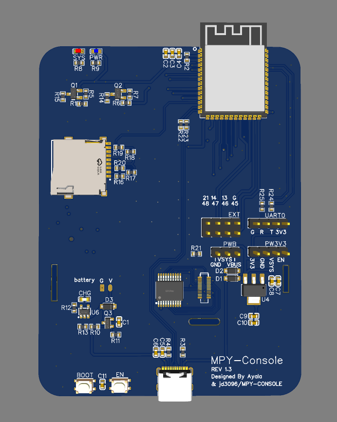

# MPY-CONSOLE Ayala 修改版

为了实现一些功能，添加了完整的背光支持，添加了全速SD卡支持，修改了五向开关的引脚定义，重新设计了电路，计划尝试一些额外的功能。

电路图：[Schematic_mpy-console_2023-08-06.pdf](./Schematic_mpy-console_2023-08-06.pdf)

Gerber制版文件（嘉立创）：[Gerber_PCB_mpy-console.zip](./Gerber_PCB_mpy-console.zip)

关于原理图的额外补充：

- 五向开关并不是对应的型号，而且采用无电阻上拉设计，BOM可以参考淘宝优信电子卖的唯一一款五向开关
- BC6561并不是一个常见元件，需要在BitCode的[官网](https://bitcode.com.cn/product/bc6561/)购买

背面预览图

-----

目前没有代加工